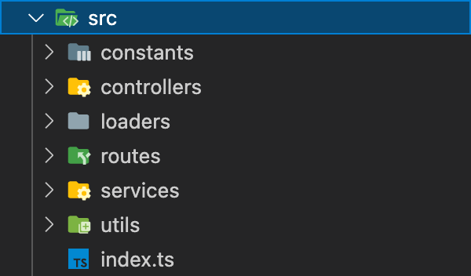

# Dialogflow ES - Fulfillment Boilerplate

This repository houses boilerplate source code for the Fulfillment function of a Dialogflow ES agent. The purpose of
this repository is to provide a generic pattern that can be spun up quickly and extended for various use cases.

## Installation

Clone the repository.
Use the package manager [npm](https://www.npmjs.com/) to install all specified dependencies

```bash
git clone
cd dialogflow-es-boilerplate
npm install
```

## Pattern / Directory Structure

The generic pattern in this repository is structured as follows:


- `constants` is where API constant values and Dialogflow agent constants are stored
- `controllers` houses our methods that are called when an intent is recognized.
- `loaders` is where our middleware code is initialized
- `routes` holds our intent mappings. This maps Dialogflow intents to their respective method calls in our fulfillment code.
- `services` holds our HTTP service calls. Methods in this directory should be called by the methods in our `controllers` directory.
- `utils` holds general utility functions to support in various directories across the project.
- `index.ts` initializes our `express` application

## Additional Configurations

In addition to the following software, there are a number of possible additions that can be made.

### Environment variables

Environment variables such as API keys, GCP credentials, and application information can be stored in various files. These files can be split up depending on the production environment that they belong to ie. `.env`, `.env`, `.env.development`, `.env.staging`, `.env.production`.
